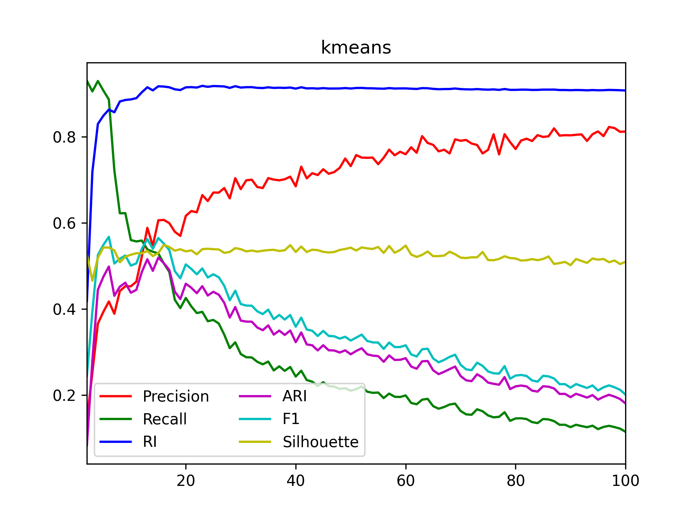
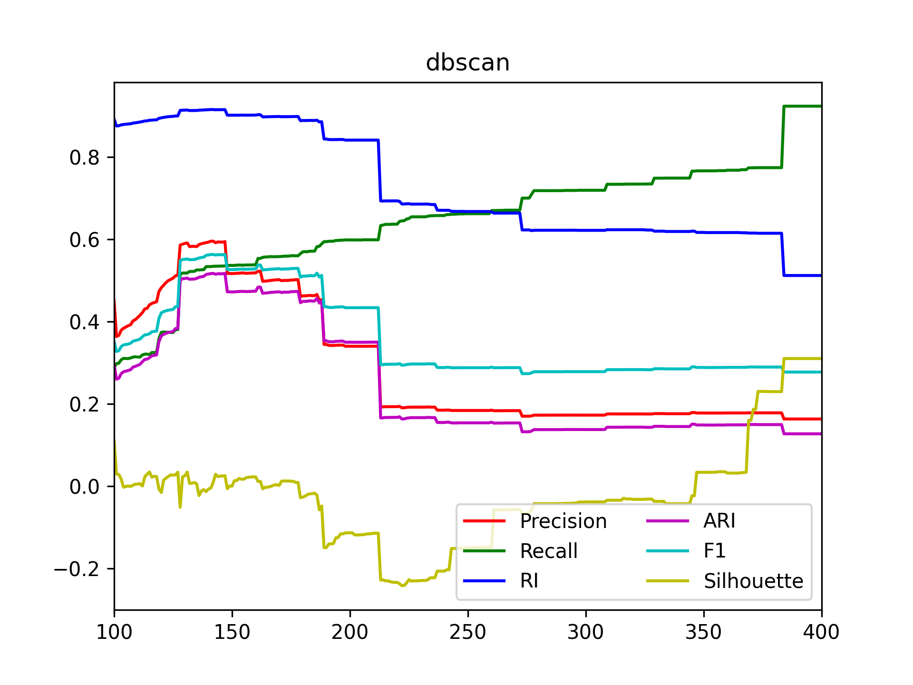
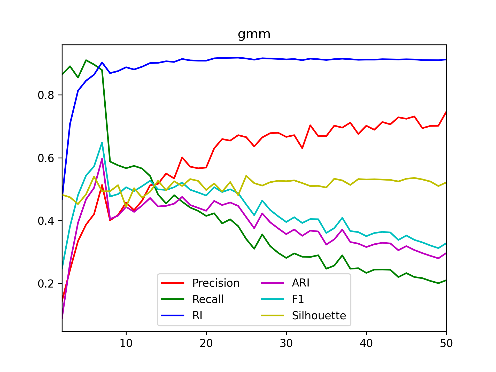
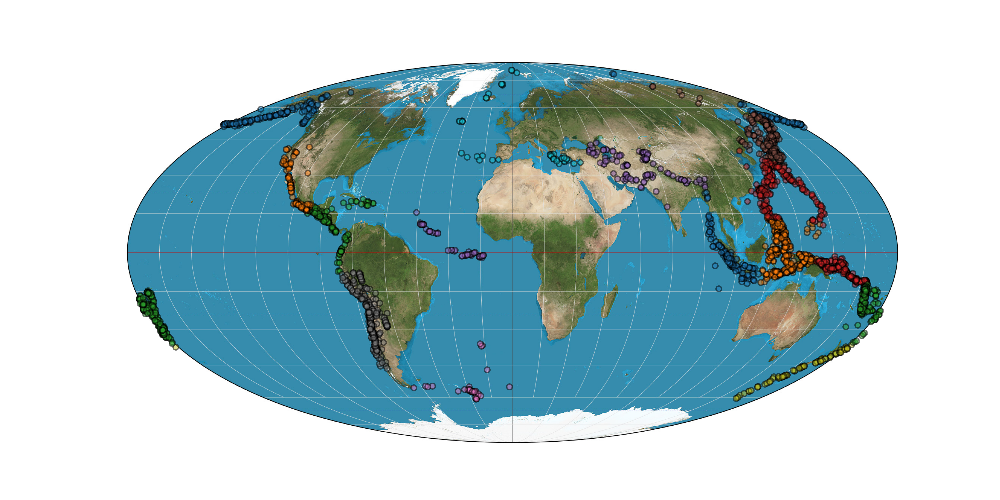
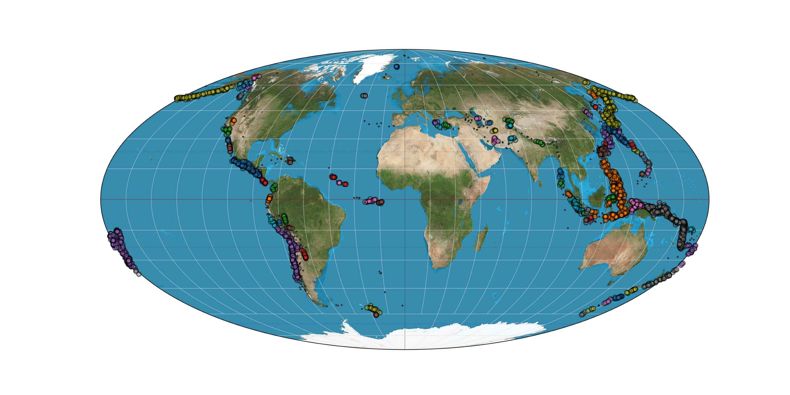

***Context:***

The goal of this project is to compare the behavior of clustering algorithms (unsupervised learning) when applied to real seismic activity events with magnitude values higher than 6,5 (in Richter scale), to attribute each cluster to a tectonic fault. The data set is comprised of every seismic event that happened between the years 1917 and 2017. The algorithms considered were k-means clustering, DBSCAN and gaussian mixture models (gmm).

To validate the results, both internal (silhouette score) and external indexes were used. Internal indexes compare metrics like cluster cohesion and data points similarity, while external indexes test the algorithm results against external information. In this case, this is only possible to use because the data set contains information about the faults linked to each seismic event. As such, it was possible to plot a confusion matrix between the "real" clusters and the algorithm results, to then apply a set of different evaluation metrics: rand index, precision, recall, f1 and adjusted rand index. The values of these metrics for each algorithm are showed in the table below.

KMeans | DBSCAN | GMM
:-----:|:------:|:----:
 |  | 

Since adjusted rand index is able to measure the relation between elements instead of the strict relation between a point and its true class, it's a good way to evaluate the algorithm capacity to split elements belonging to different classes. Thus, the best results for each algorithm were picked according to its ARI, with their cluster maps showed below.

KMeans (k=15) | DBSCAN (eps=142) | GMM (n=7)
:------------:|:----------------:|:----------:
 |  | 

As the ARI results are very similar across the three algorithms (0.52, 0.52, 0.6), it's difficult to conclude with a high degree of confidence what's the best clustering choice for the problem discussed. From a theoretical standpoint, we could maybe exclude KMeans, as it was designed to better suit globular clusters (which is not the case with tectonic faults), and DBSCAN, for its difficulty to deal with two different clusters very close to each other. In the end, though, the results are not clear enough to back that up.

***Running with Python:***

```
git clone https://github.com/danielmurteira/ml-earthquakes.git
python earthquakes.py
```

***Running with Docker:***

```
git clone https://github.com/danielmurteira/ml-earthquakes.git
docker build -t dmurteira/ml-earthquakes .
docker run --name ml-earthquakes -v %cd%/report:/home/report --rm -d dmurteira/ml-earthquakes
```